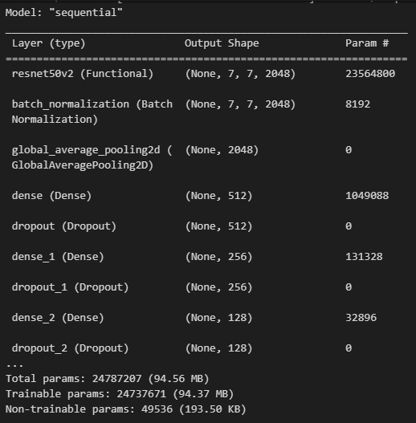
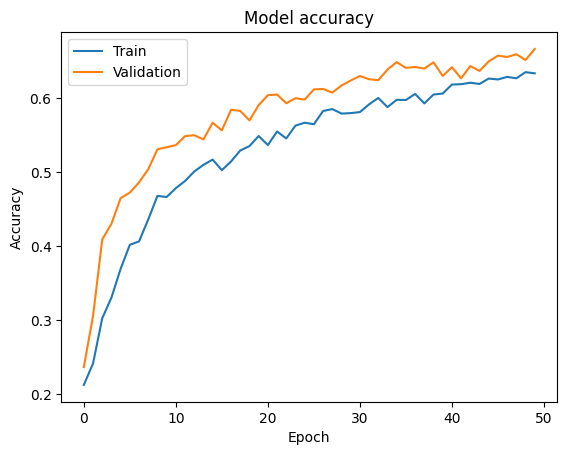
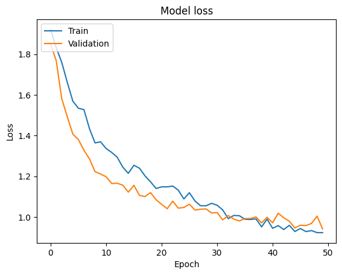
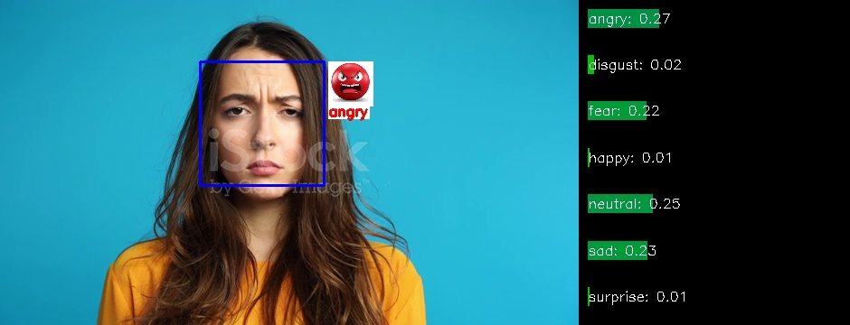
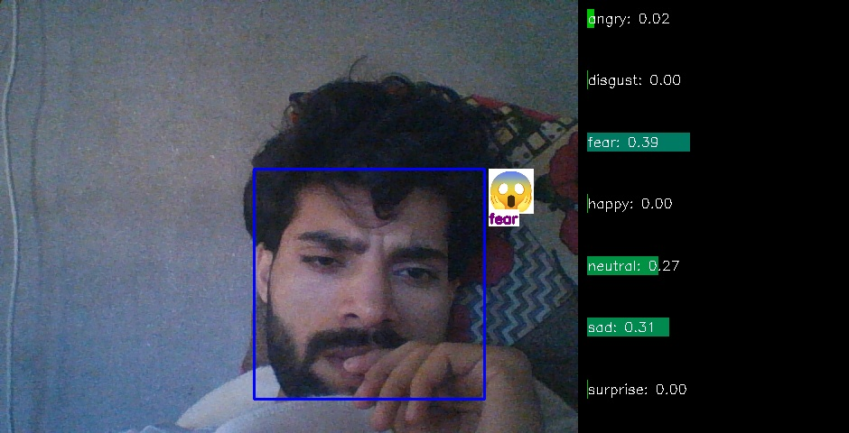
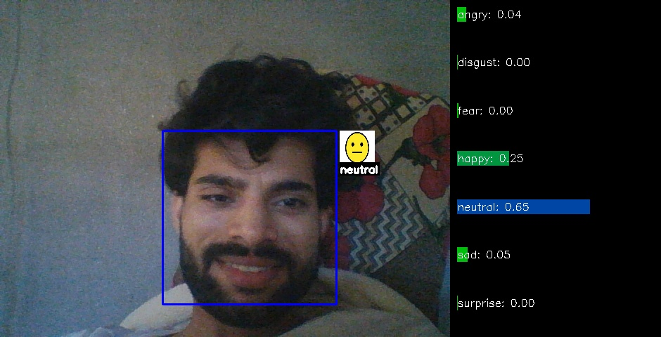
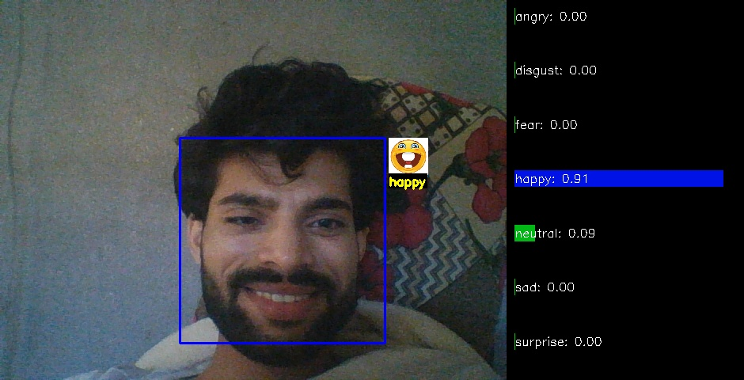
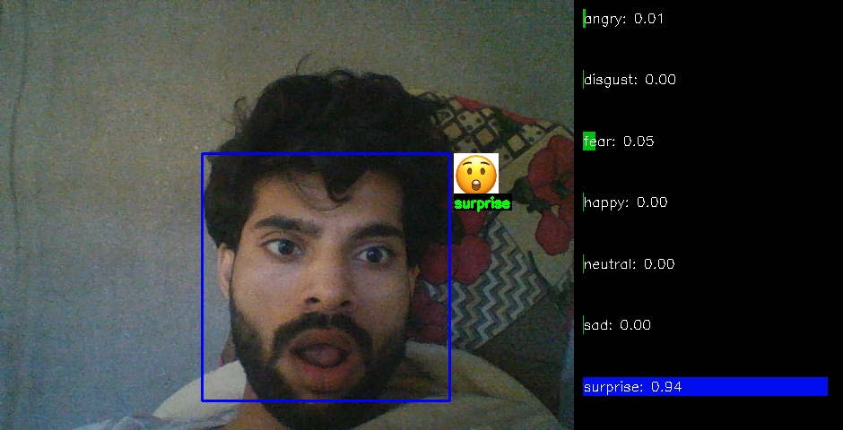
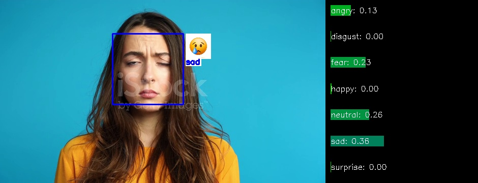

# Facial Recognition and Emotion Classification

**Date**: 30-04-2024  
**Author**: Rizwan
## Video Demo
Check out our video demonstration below:

[](https://youtu.be/DWdOpYOmmo0)

## Project Description
This project builds a real-time emotion detection system using facial recognition and machine learning to identify various emotions from webcam feeds. It displays the detected emotions with corresponding images and names on the screen. Additionally, a dynamic score bar graph shows confidence levels for each detected emotion, enhancing user interaction and system understanding. The system is trained to modulate webcam images based on the subject's expressions in real time and pre-recorded videos using a variety of emotions including 'angry', 'disgust', 'fear', 'happy', 'neutral', 'sad', and 'surprise'.

## Data Source
The model is trained on the FER dataset from Kaggle, containing various facial expressions categorized into seven classes. For more information and access to the dataset, visit the [FER2013 Dataset on Kaggle](https://www.kaggle.com/datasets/msambare/fer2013).

## Dataset Composition
**Training Set:**
| Emotion   | Number of Images |
|-----------|------------------|
| Angry     | 3993 images      |
| Disgust   | 436 images       |
| Fear      | 4103 images      |
| Happy     | 7164 images      |
| Neutral   | 4982 images      |
| Sad       | 4938 images      |
| Surprise  | 3205 images      |

**Test Set:**
| Emotion   | Number of Images |
|-----------|------------------|
| Angry     | 960 images       |
| Disgust   | 111 images       |
| Fear      | 1018 images      |
| Happy     | 1825 images      |
| Neutral   | 1216 images      |
| Sad       | 1139 images      |
| Surprise  | 797 images       |

## Model Architecture
This system uses a sophisticated machine learning model built on the ResNet50V2 architecture, pre-trained on ImageNet and adapted for emotion detection. It includes features such as Batch Normalization, Global Average Pooling2D, and Dense layers with Dropout, culminating in a softmax activation function for classifying the seven emotions.

## Performance Metrics
- **Training Accuracy**: Improved from 21.2% to 63.3% over 50 epochs.
- **Validation Accuracy**: Increased from 23.7% to 66.6%.



## Some Results








## Videos
<video src="web/images/predicted_emo/v1.mp4" controls title="Real Time"></video>
<video src="Demo%20of%20work.mp4" controls title="Real Time 2"></video>

### Install from Source

```bash
# Create a Conda environment
conda create --name facial_emotion_recognition python=3.10
# Activate the Conda environment
conda activate facial_emotion_recognition

# Clone the repository
git clone https://github.com/Rizwanali324/Facial_Recognation-Emotions_Classification.git
cd facial_emotion_recognition

# Install the project dependencies
pip install -r requirements.txt
**Running the Code**
python code/emotion.py


**Converting the Model to TFLite**

python code/converter.py
```
## Tech used
<p align="left">  
  <a href="https://opencv.org/" target="_blank" rel="noreferrer"> 
     
  </a> 
  <a href="https://pandas.pydata.org/" target="_blank" rel="noreferrer"> 
    
  </a> 
  <a href="https://www.python.org" target="_blank" rel="noreferrer"> 
    
  </a> 
  <a href="https://pytorch.org/" target="_blank" rel="noreferrer"> 
    
  </a>  
  <a href="https://scikit-learn.org/" target="_blank" rel="noreferrer"> 
    
  </a>  
  <a href="https://www.tensorflow.org" target="_blank" rel="noreferrer"> 
    
  </a>
  <!-- New additions with provided URLs -->
  <a href="https://numpy.org/" target="_blank" rel="noreferrer">
    
  </a>
  <a href="https://keras.io/" target="_blank" rel="noreferrer">
    
  </a>
</p>

## Future Enhancements
To enhance model performance and robustness:
- **Dataset Expansion**: Include a broader range of facial expressions and real-world conditions.
- **Multimodal Data Integration**: Incorporate audio cues alongside visual data.
- **Advanced Neural Architectures**: Explore deep convolutional networks, recurrent neural networks, or attention-based models.

## Conclusion
This emotion detection project aims to enhance human-computer interaction by enabling computers to interpret human emotions accurately, demonstrating promising applications in various real-world settings.

